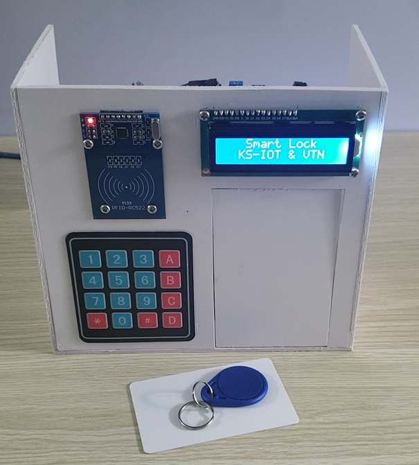

# STM32 | Smart Door Lock System 🔐
Author: **Kael Shelby** (VTN)

## 📖 1. Introduction
This project implements a **Smart Door Lock System** using the **STM32F103C8T6 (Blue Pill)** microcontroller.  
The system operates with **two-step authentication**:
1. RFID card scanning  
2. Password entry via 4x4 keypad  

When authentication is successful, the door is unlocked using a **servo motor** for 5 seconds and then automatically locked again. A **16x2 LCD** provides real-time instructions, and a **buzzer** generates audio feedback for each event.

<div align="center">
  
</div>

## 🛠️ 2. Hardware Requirements
To build this project, you will need:
- STM32F103C8T6 (Blue Pill board)  
- RFID Reader (RC522 or similar) + 2 RFID cards  
- 16x2 LCD (I²C module recommended)  
- 4x4 Matrix Keypad  
- Servo Motor (SG90/MG90S)  
- Buzzer (active or passive)  
- 5V Power supply, jumper wires, breadboard or PCB  

<div align="center">
  
</div>

## 🔌 3. Circuit Diagram


### Pin Mapping

                              | Device             | Module Pin | STM32F103C8T6 | Description          |
                              |--------------------|------------|---------------|----------------------|
                              | **RFID RC522**     | VCC        | 3.3V          | Power supply 3.3V    |
                              |                    | RST        | PB0           | Reset                |
                              |                    | GND        | GND           | Common ground        |
                              |                    | MISO       | PA6           | SPI1 MISO            |
                              |                    | MOSI       | PA7           | SPI1 MOSI            |
                              |                    | SCK        | PA5           | SPI1 SCK             |
                              |                    | SDA (NSS)  | PA4           | SPI1 CS              |
                              | **LCD 16x2 (I²C)** | VCC        | 5V            | Power supply 5V      |
                              |                    | GND        | GND           | Common ground        |
                              |                    | SDA        | PB7           | I²C1 SDA             |
                              |                    | SCL        | PB6           | I²C1 SCL             |
                              | **Keypad 4x4**     | R1–R4      | PB12–PB15     | Row lines            |
                              |                    | C1–C4      | PA8–PA11      | Column lines         |
                              | **Servo**          | VCC        | 5V            | Power supply 5V      |
                              |                    | GND        | GND           | Common ground        |
                              |                    | Signal     | PB8           | PWM                  |
                              | **Buzzer**         | VCC        | 5V            | Power supply 5V      |
                              |                    | GND        | GND           | Common ground        |
                              |                    | Signal     | PA0           | GPIO Output          |

> ⚠️ Notes:  
> - Servo and RFID require a stable power supply, recommended to use an external 5V source.  
> - Ensure all devices share a common ground (GND).  

---

## 🎥 4. Demo and Results
👉 [Watch the demo video](https://www.tiktok.com/@kshelbyiot/video/7533210389182532882?is_from_webapp=1&sender_device=pc&web_id=7500959777037518344)

<p align="center">
  <a href="https://www.tiktok.com/@kshelbyiot/video/7533210389182532882?is_from_webapp=1&sender_device=pc&web_id=7500959777037518344">
    
  </a>
</p>

---

## 🚀 5. Getting Started
1. **Clone the project from GitHub**  
   ```bash
   git clone <url>
2. **Open the project with Keil C (uVision)**
- Main source file: main.c
3. **Connect hardware according to the diagram in Section 3**
4. **Flash the firmware using ST-Link V2 or USB-UART**
5. **Expected Results:**
- LCD displays system instructions: scan card, enter password, door status
- Buzzer provides audio feedback for each event (success/failure, open/close)
- Servo unlocks the door for 5 seconds, then locks it automatically
- System resets to the initial RFID scan state